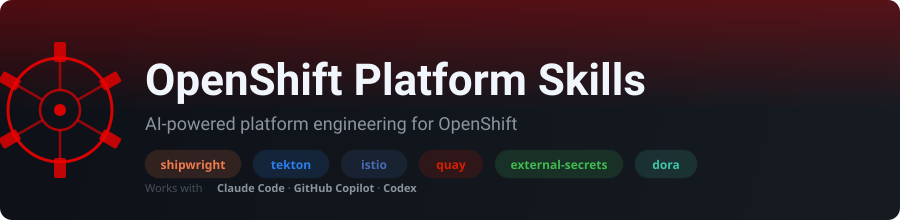

<p align="center">
  
</p>

<p align="center">
  <a href="LICENSE"></a>
  <a href="CONTRIBUTING.md"></a>
  
  
  
  
</p>

<p align="center">
  <b>Give your AI agent deep expertise in OpenShift platform engineering.</b><br>
  Build images, run pipelines, manage registries, rotate secrets, configure service mesh,
  and measure DORA metrics — all from your terminal.
</p>

---

<details>
<summary><b>Quick Start</b></summary>

```shell
# Claude Code
/plugin marketplace add alimobrem/openshift-platform-skills
/plugin install openshift-platform-skills@platform

# Then try:
# "Audit this repo for platform engineering best practices"
# "Create a Tekton pipeline for my Go microservice"
# "Set up ExternalSecret to pull from AWS Secrets Manager"
```

</details>

## Install

<details>
<summary><b>Claude Code</b></summary>

```shell
/plugin marketplace add alimobrem/openshift-platform-skills
/plugin install openshift-platform-skills@platform
```

After install, the `platform` agent appears in `/agents` and the 4 skills
(`platform-ci`, `platform-mesh`, `platform-infra`, `platform-integration`)
auto-trigger based on context. Run `/reload-plugins` if they don't appear immediately.

</details>

<details>
<summary><b>Codex</b></summary>

Add to `$REPO_ROOT/.agents/plugins/marketplace.json` or `~/.agents/plugins/marketplace.json`:

```json
{
  "name": "openshift-platform-skills",
  "category": "Developer Tools",
  "source": {
    "source": "url",
    "url": "https://github.com/alimobrem/openshift-platform-skills.git",
    "ref": "main"
  },
  "policy": {
    "installation": "AVAILABLE",
    "authentication": "ON_INSTALL"
  }
}
```

</details>

<details>
<summary><b>GitHub Copilot</b></summary>

Copy the agent file to your repository:

```shell
mkdir -p .github/copilot
cp agents/github-copilot/platform-engineering.agent.md .github/copilot/
```

</details>

<details>
<summary><b>Prerequisites</b></summary>

**Target platform:** OpenShift Container Platform **4.22 or later**

**Required:**
- `oc` CLI (OpenShift client) — cluster interaction, resource management

**Red Hat Operators (install via OperatorHub):**

| Operator | Subscription Name | Catalog | Purpose |
|----------|------------------|---------|---------|
| Red Hat OpenShift Pipelines | `openshift-pipelines-operator-rh` | `redhat-operators` | Tekton pipelines, triggers, chains |
| Builds for Red Hat OpenShift | `openshift-builds-operator` | `redhat-operators` | Shipwright container builds |
| Red Hat OpenShift Service Mesh 3 | `servicemeshoperator3` | `redhat-operators` | Istio control plane (Sail operator) |
| Red Hat Quay | `quay-operator` | `redhat-operators` | Container image registry + Clair scanning |
| External Secrets Operator | `external-secrets-operator` | `redhat-operators` | Secrets sync from Vault/AWS/Azure/GCP |
| Kiali | `kiali-ossm` | `redhat-operators` | Service mesh observability dashboard |
| Red Hat build of OpenTelemetry | `opentelemetry-product` | `redhat-operators` | Distributed tracing |

All operators use the `redhat-operators` catalog — no community or upstream operators.

**Optional CLI tools (enhances capabilities):**
- `tkn` — Tekton pipeline inspection and triggering
- `istioctl` — Istio mesh analysis and debugging
- `argocd` — Argo CD operations (if using argo-skills alongside)
- `yq` — YAML parsing
- `skopeo` — container image inspection

Install CLI tools on macOS:
```shell
brew bundle
```

</details>

## Usage Guide

> **Full guide with all example prompts:** [docs/USER_GUIDE.md](docs/USER_GUIDE.md)

### How Routing Works

The agent automatically selects the right layer based on what you ask:

```
 Build an image ─────────► platform-ci          Shipwright / Buildah
 Run a pipeline ─────────► platform-ci          Tekton Pipelines & Triggers
 Configure mesh ─────────► platform-mesh        Istio / OpenShift Service Mesh
 Manage images ──────────► platform-infra       Quay / scanning / signing
 Rotate secrets ─────────► platform-infra       ExternalSecretOperator / Vault
 Ship a release ─────────► platform-integration Progressive delivery flows
 Onboard a team ─────────► platform-integration Namespace / quotas / RBAC
 Measure velocity ───────► platform-integration DORA four keys
 Debug failures ─────────► platform-integration Cross-layer troubleshooting
```

You don't need to invoke layers manually — just describe what you need.

### Build — Shipwright & Buildah

Use when you need to build container images on OpenShift.

```text
# Create builds
Create a Shipwright Build for my Go app using the buildah ClusterBuildStrategy.

# Troubleshoot
Why is my BuildRun stuck in pending?
Debug the failing S2I build in namespace myapp.

# Best practices
What's the best way to structure a multi-arch build pipeline?
```

### Pipeline — Tekton Pipelines & Triggers

Use when you need CI/CD pipelines on OpenShift.

```text
# Create pipelines
Generate a Tekton Pipeline that clones, builds, scans, and deploys a Java app.
Create an EventListener with a GitHub push trigger.

# Debug
Why did my PipelineRun fail at the build-image step?
Show me the logs for the last failed TaskRun in namespace ci.

# Optimize
How do I cache Maven dependencies across PipelineRuns?
Set up workspace sharing between tasks.
```

### Registry — Quay & Image Management

Use when managing container images and registries.

```text
# Setup
Configure Quay mirror registry for air-gapped deployment.
Set up image signing with cosign and Tekton.

# Operations
Create a robot account for CI pull/push access.
Set up tag expiration policies for dev images.
```

### Secrets — External Secrets Operator

Use when managing secrets and credentials.

```text
# Setup
Set up ExternalSecretOperator to sync secrets from AWS Secrets Manager.
Create a ClusterSecretStore for HashiCorp Vault.

# Operations
Rotate the database credentials in namespace production.
Audit all ExternalSecrets for sync failures.
```

### Mesh — Istio & OpenShift Service Mesh

Use when configuring service mesh and traffic management.

```text
# Setup
Enable strict mTLS for the payments namespace.
Create a VirtualService with 90/10 canary traffic split.

# Debug
Why is my service getting 503s after enabling mTLS?
Analyze the mesh configuration for security issues.

# Traffic management
Set up fault injection to test resilience.
Configure request timeouts and circuit breakers for the API gateway.
```

### Delivery — Progressive Rollouts

Use when shipping releases safely.

```text
# Deploy
Create a canary rollout with automated analysis for the frontend service.
Set up blue-green deployment with traffic switching.

# Promote
Promote the canary rollout in production.
Abort the failing rollout and roll back.
```

### Onboarding — Team & Namespace Provisioning

Use when onboarding teams or setting up namespaces.

```text
# Provision
Create a new namespace with standard quotas and network policies.
Set up RBAC for the data-science team across dev/staging/prod.

# Audit
Review quota utilization across all team namespaces.
Check for namespaces missing network policies.
```

### Metrics — DORA Four Keys

Use when measuring engineering velocity and reliability.

```text
# Measure
Calculate DORA metrics from our Tekton PipelineRuns and deployments.
What's our deployment frequency and lead time for the payments service?

# Improve
Our change failure rate is 15%. What should we focus on?
How do I set up automated DORA metric collection?
```

### Debug — Cross-Layer Troubleshooting

Use when something is broken and you're not sure which layer is at fault.

```text
# Investigate
The app deployed but isn't reachable. What's wrong?
Debug the full path from build to deployment for the checkout service.

# Health check
Run a platform health check across all layers.
```

<details>
<summary><b>Swappable components</b></summary>

The skill supports multiple implementations at each layer:

| Layer | Primary | Alternatives |
|-------|---------|-------------|
| Build | Shipwright | Buildah, S2I, Kaniko |
| Pipeline | Tekton | — |
| Registry | Quay | OpenShift internal registry |
| Secrets | External Secrets Operator | Sealed Secrets, Vault CSI |
| Mesh | Istio / OSSM | — |
| Delivery | Argo Rollouts | OpenShift DeploymentConfig |

The agent detects which components are installed on your cluster and adapts accordingly.

</details>

<details>
<summary><b>Safety model</b></summary>

| Step | What happens |
|------|-------------|
| Generate | Produces YAML manifest or CLI command, shows it in a code block |
| Preview | Runs `--dry-run=client`, `kubectl diff`, or `oc diff` to show what changes |
| Confirm | Asks "Apply this? (yes/no)" — does NOT proceed without explicit approval |

Read-only operations (status checks, metric queries) skip confirmation.

Destructive operations (delete, scale-to-zero, rollback) require typing the resource name to confirm.

</details>

## Benchmarks

Evals test **outcomes** — YAML correctness, diagnostic reasoning, trade-off analysis,
and security judgment. 19 evals across 4 skills, tested on Opus and Sonnet.

<table>
<thead>
<tr>
<th width="200">Skill</th>
<th width="80">Evals</th>
<th width="100">Opus</th>
<th width="100">Sonnet</th>
<th>Highlights</th>
</tr>
</thead>
<tbody>
<tr>
<td><a href="benchmarks/platform-ci.md"><b>platform-ci</b></a></td>
<td>5</td>
<td><b>44/45 (98%)</b></td>
<td><b>20/20 (100%)</b></td>
<td>YAML gen, diagnose broken PipelineRun, Shipwright vs Buildah trade-off</td>
</tr>
<tr>
<td><a href="benchmarks/platform-mesh.md"><b>platform-mesh</b></a></td>
<td>5</td>
<td><b>43/49 (88%)</b></td>
<td><b>9/10 (90%)</b></td>
<td>YAML gen, canary vs blue-green trade-off, diagnose mTLS 503s</td>
</tr>
<tr>
<td><a href="benchmarks/platform-infra.md"><b>platform-infra</b></a></td>
<td>4</td>
<td><b>34/34 (100%)</b></td>
<td><b>20/20 (100%)</b></td>
<td>YAML gen, refuse hardcoded creds, diagnose ESO kind mismatch</td>
</tr>
<tr>
<td><a href="benchmarks/platform-integration.md"><b>platform-integration</b></a></td>
<td>5</td>
<td><b>48/48 (100%)</b></td>
<td><b>40/40 (100%)</b></td>
<td>E2E flow, onboarding, DORA, diagnose Rollout vs Argo CD sync</td>
</tr>
<tr>
<td><b>Total</b></td>
<td><b>19</b></td>
<td><b>169/176 (96%)</b></td>
<td><b>89/90 (99%)</b></td>
<td></td>
</tr>
</tbody>
</table>

<sub>Run <code>make test-all</code> to run all 12 evals. Per-skill: <code>make test-ci</code>, <code>make test-mesh</code>, etc.</sub>

## Contributing

Contributions are welcome! Please see [CONTRIBUTING.md](CONTRIBUTING.md) for guidelines.

<details>
<summary><b>Development</b></summary>

```shell
# Install prerequisites (macOS)
brew bundle

# Run all evals
make test-all

# Run per-skill evals
make test-ci test-mesh test-infra test-integration

# Run script tests
make test-scripts
```

See [AGENTS.md](AGENTS.md) for the repo layout, skill conventions, and eval runner instructions.

</details>

## Links

### Red Hat Operators

| Operator | Docs | Source |
|----------|------|--------|
| Red Hat OpenShift Pipelines | [Docs](https://docs.redhat.com/en/documentation/red_hat_openshift_pipelines/) | [github.com/openshift-pipelines](https://github.com/openshift-pipelines) |
| Builds for Red Hat OpenShift | [Docs](https://docs.openshift.com/builds/1.0/about/overview-openshift-builds.html) | [github.com/redhat-openshift-builds](https://github.com/redhat-openshift-builds) |
| Red Hat OpenShift Service Mesh 3 | [Docs](https://docs.redhat.com/en/documentation/red_hat_openshift_service_mesh/3.0/) | [github.com/openshift-service-mesh](https://github.com/openshift-service-mesh) |
| Red Hat Quay | [Docs](https://docs.redhat.com/en/documentation/red_hat_quay/3/) | [github.com/quay/quay-operator](https://github.com/quay/quay-operator) |
| External Secrets Operator | [Docs](https://docs.redhat.com/en/documentation/openshift_container_platform/4.19/html/security_and_compliance/external-secrets-operator-for-red-hat-openshift) | [github.com/external-secrets/external-secrets](https://github.com/external-secrets/external-secrets) |
| Kiali | [Docs](https://docs.redhat.com/en/documentation/red_hat_openshift_service_mesh/3.0/html/kiali/) | [github.com/kiali/kiali](https://github.com/kiali/kiali) |
| Red Hat build of OpenTelemetry | [Docs](https://docs.redhat.com/en/documentation/red_hat_build_of_opentelemetry/) | [github.com/open-telemetry](https://github.com/open-telemetry) |

### Upstream Projects

| Project | Repo |
|---------|------|
| Tekton Pipelines | [github.com/tektoncd/pipeline](https://github.com/tektoncd/pipeline) |
| Shipwright | [github.com/shipwright-io/build](https://github.com/shipwright-io/build) |
| Istio / Sail Operator | [github.com/istio-ecosystem/sail-operator](https://github.com/istio-ecosystem/sail-operator) |
| Argo CD | [github.com/argoproj/argo-cd](https://github.com/argoproj/argo-cd) |
| Argo Rollouts | [github.com/argoproj/argo-rollouts](https://github.com/argoproj/argo-rollouts) |
| GitOps Promoter | [github.com/argoproj-labs/gitops-promoter](https://github.com/argoproj-labs/gitops-promoter) |

### Companion Repo

| Repo | Description |
|------|-------------|
| [alimobrem/argo-skills](https://github.com/alimobrem/argo-skills) | AI Agent Skills for Argo CD, Rollouts, Workflows, Events — complements this repo for the GitOps layer |

## Code of Conduct

This project follows the [Contributor Covenant Code of Conduct](CODE_OF_CONDUCT.md).

## Security

See [SECURITY.md](SECURITY.md) for reporting vulnerabilities.

## License

[MIT License](LICENSE)
